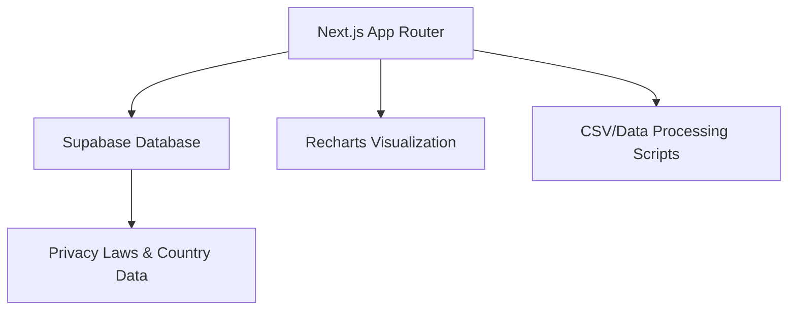

# SERVICES-INFO

An advanced analytics and compliance dashboard designed to track global privacy laws, service performance, and regulatory data. Built for transparency and data-driven decision-making in the privacy and tech space.

## 🚀 Key Features

- **Global Privacy Law Tracker:** Interactive database of regulations like GDPR, CCPA, and AI Act.
- **Analytics Dashboard:** Real-time data visualization using Recharts for service metrics.
- **Compliance Tools:** Automated risk assessment and comparison tools for different legal frameworks.
- **Country-Specific Data:** Deep-dive analytics and compliance status for over 100 countries.
- **Theme Support:** Fully responsive design with Dark/Light mode support.

## 🏗️ Technical Architecture



**High-Level Flow:**
```
[ Browser ] <────> [ Next.js Frontend ]
                          │
            ┌─────────────┴─────────────┐
            │                           │
    [ Supabase Auth/DB ]       [ Analytics Engine ]
            │                           │
    [ Global Law Data ]        [ Recharts Rendering ]
```

## 🛠️ Tech Stack

- **Frontend:** Next.js (App Router), TypeScript, Tailwind CSS, Lucide React
- **Visualization:** Recharts
- **Backend/Database:** Supabase (PostgreSQL)
- **UI Components:** Shadcn/ui, Radix UI

## 🏃 How to Run

### Prerequisites
- Node.js 20+
- Supabase account (for database features)

### Installation
```bash
# Clone the repository
git clone https://github.com/pavandongare/services-info.git
cd services-info

# Install dependencies
npm install
```

### Environment Setup
Create a `.env.local` file with your Supabase credentials:
```
NEXT_PUBLIC_SUPABASE_URL=your_url
NEXT_PUBLIC_SUPABASE_ANON_KEY=your_key
```

### Development
```bash
# Run the development server
npm run dev
```

### Seeding Data
```bash
# To seed the database with initial law/country data
npx tsx src/scripts/seed-supabase.ts
```

---
Built with ❤️ by [Pavan Dongare](https://github.com/pavandongare)
